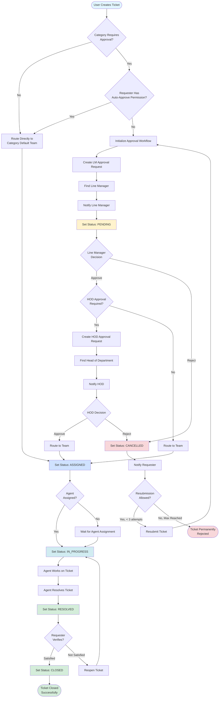
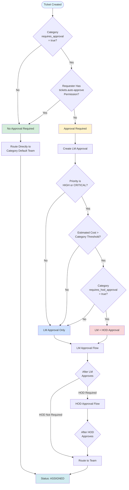
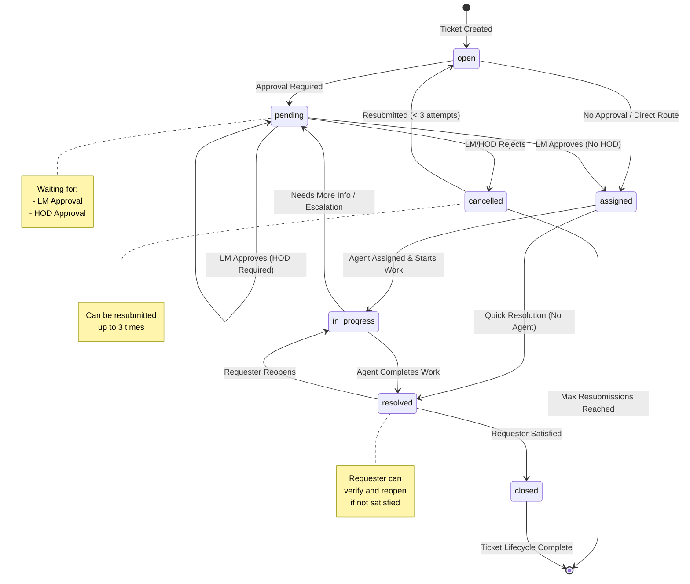
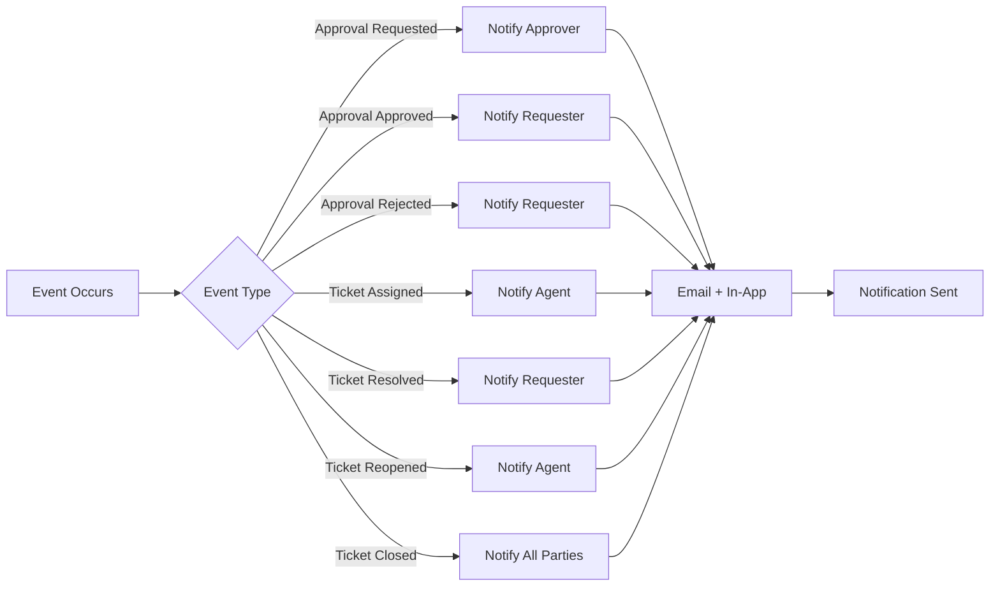
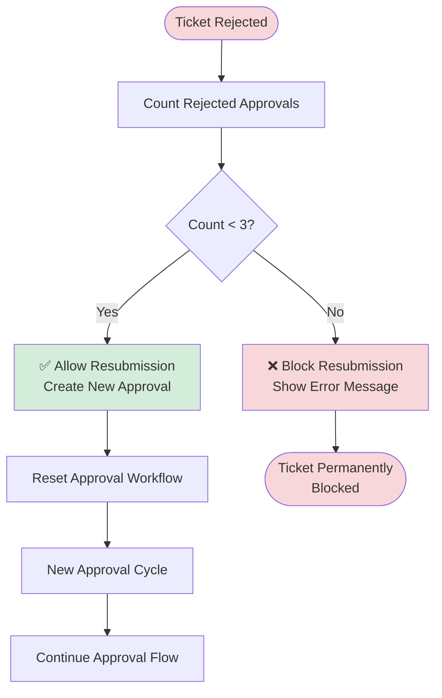
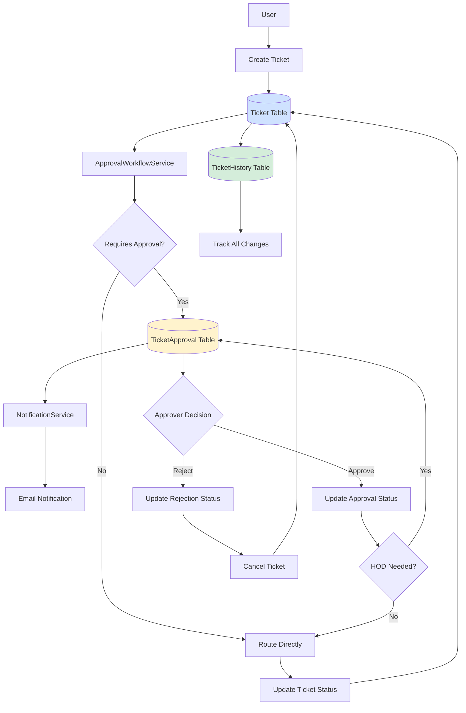

# Ticket Workflow - Detailed Flowchart

This document provides comprehensive flowcharts for the entire ticket lifecycle, including creation, approval workflow, assignment, resolution, and resubmission processes.

---

## 1. Main Ticket Lifecycle Flow



---

## 2. Approval Workflow Decision Tree



---

## 3. Line Manager Approval Flow

```mermaid
flowchart TD
    Start([Ticket Submitted]) --> CreateApproval[Create TicketApproval<br/>approval_level: 'lm'<br/>status: 'pending'<br/>sequence: 1]
    
    CreateApproval --> FindLM{Find Line Manager}
    
    FindLM --> CheckRequesterDept{Requester Has<br/>Department?}
    CheckRequesterDept -->|Yes| GetDeptManager[Get Department Manager]
    CheckRequesterDept -->|No| CheckAssignedTeam{Assigned Team<br/>Set?}
    
    GetDeptManager --> CheckManagerExists{Manager<br/>Exists?}
    CheckManagerExists -->|Yes| AssignLMApprover[Assign approver_id]
    CheckManagerExists -->|No| CheckAssignedTeam
    
    CheckAssignedTeam -->|Yes| GetTeamManager[Get Team Manager]
    CheckAssignedTeam -->|No| CheckCategoryTeam{Category Default<br/>Team Set?}
    
    GetTeamManager --> CheckTeamManagerExists{Team Manager<br/>Exists?}
    CheckTeamManagerExists -->|Yes| AssignLMApprover
    CheckTeamManagerExists -->|No| CheckCategoryTeam
    
    CheckCategoryTeam -->|Yes| GetCategoryTeamManager[Get Category Team Manager]
    CheckCategoryTeam -->|No| NoLMFound[No LM Found<br/>Log Warning]
    
    GetCategoryTeamManager --> AssignLMApprover
    AssignLMApprover --> UpdateApproval[Update Approval<br/>with approver_id]
    
    UpdateApproval --> CreateHistory[Create Ticket History<br/>action: 'approval_requested'<br/>description: 'Ticket submitted for<br/>Line Manager approval']
    
    CreateHistory --> SendNotification[Send Email Notification<br/>to Line Manager]
    
    SendNotification --> StatusPending[Set Ticket Status<br/>to 'pending']
    
    StatusPending --> WaitForDecision{Wait for LM<br/>Decision}
    
    WaitForDecision -->|Approve| ProcessApproval[Process Approval]
    WaitForDecision -->|Reject| ProcessRejection[Process Rejection]
    
    ProcessApproval --> UpdateApprovalStatus[Update Approval<br/>status: 'approved'<br/>approved_at: now]
    
    UpdateApprovalStatus --> CreateApprovalHistory[Create History<br/>action: 'approved'<br/>description: 'Line Manager<br/>approved the ticket']
    
    CreateApprovalHistory --> SendApprovalNotification[Notify Requester<br/>of Approval]
    
    SendApprovalNotification --> CheckHODNeeded{HOD Approval<br/>Required?}
    
    CheckHODNeeded -->|Yes| KeepPending[Keep Status: PENDING<br/>Create HOD Approval]
    CheckHODNeeded -->|No| RouteToTeam[Route to Team<br/>Status: ASSIGNED]
    
    ProcessRejection --> UpdateRejectionStatus[Update Approval<br/>status: 'rejected'<br/>rejected_at: now]
    
    UpdateRejectionStatus --> CreateRejectionHistory[Create History<br/>action: 'rejected'<br/>description: 'Line Manager<br/>rejected the ticket']
    
    CreateRejectionHistory --> CancelTicket[Set Ticket Status<br/>to 'cancelled']
    
    CancelTicket --> SendRejectionNotification[Notify Requester<br/>of Rejection]
    
    SendRejectionNotification --> EndRejected([Ticket Rejected])
    
    NoLMFound --> CreateHistory
    
    style Start fill:#e1f5ff
    style StatusPending fill:#fff3cd
    style RouteToTeam fill:#cfe2ff
    style EndRejected fill:#f8d7da
    style KeepPending fill:#fff3cd
```



---

## 4. HOD Approval Flow

```mermaid
flowchart TD
    LMApproved([LM Approved Ticket]) --> CheckHODRequired{Check if HOD<br/>Approval Required}
    
    CheckHODRequired --> CheckPriority{Priority is<br/>HIGH or CRITICAL?}
    CheckPriority -->|No| CheckCost{Estimated Cost ><br/>Category Threshold?}
    CheckPriority -->|Yes| CheckCategoryHOD{Category<br/>requires_hod_approval?}
    
    CheckCost -->|No| NoHODNeeded[No HOD Approval Needed]
    CheckCost -->|Yes| CheckCategoryHOD
    
    CheckCategoryHOD -->|No| NoHODNeeded
    CheckCategoryHOD -->|Yes| HODNeeded[HOD Approval Required]
    
    NoHODNeeded --> RouteAfterLM[Route to Team<br/>Status: ASSIGNED]
    
    HODNeeded --> CheckExistingHOD{Existing HOD<br/>Approval?}
    
    CheckExistingHOD -->|Pending Exists| SkipCreate[Skip - Already Exists]
    CheckExistingHOD -->|Approved Exists| SkipCreate
    CheckExistingHOD -->|None| CreateHODApproval[Create TicketApproval<br/>approval_level: 'hod'<br/>status: 'pending'<br/>sequence: max + 1]
    
    SkipCreate --> WaitForHOD
    
    CreateHODApproval --> FindHOD{Find HOD}
    
    FindHOD --> CheckAssignedTeam{Assigned Team<br/>Set?}
    CheckAssignedTeam -->|Yes| GetTeamHOD[Get Team HOD]
    CheckAssignedTeam -->|No| CheckCategoryTeam{Category Default<br/>Team Set?}
    
    GetTeamHOD --> CheckTeamHODExists{Team HOD<br/>Exists?}
    CheckTeamHODExists -->|Yes| AssignHODApprover[Assign approver_id]
    CheckTeamHODExists -->|No| CheckCategoryTeam
    
    CheckCategoryTeam -->|Yes| GetCategoryTeamHOD[Get Category Team HOD]
    CheckCategoryTeam -->|No| CheckRequesterDept{Requester<br/>Department?}
    
    GetCategoryTeamHOD --> CheckCategoryHODExists{Category HOD<br/>Exists?}
    CheckCategoryHODExists -->|Yes| AssignHODApprover
    CheckCategoryHODExists -->|No| CheckRequesterDept
    
    CheckRequesterDept -->|Yes| GetDeptHOD[Get Department HOD]
    CheckRequesterDept -->|No| NoHODFound[No HOD Found<br/>Log Warning]
    
    GetDeptHOD --> AssignHODApprover
    AssignHODApprover --> UpdateHODApproval[Update Approval<br/>with approver_id]
    
    UpdateHODApproval --> CreateHODHistory[Create Ticket History<br/>action: 'approval_requested'<br/>description: 'Ticket submitted for<br/>Head of Department approval']
    
    CreateHODHistory --> SendHODNotification[Send Email Notification<br/>to HOD]
    
    SendHODNotification --> WaitForHOD{Wait for HOD<br/>Decision}
    
    NoHODFound --> WaitForHOD
    
    WaitForHOD -->|Approve| ProcessHODApproval[Process HOD Approval]
    WaitForHOD -->|Reject| ProcessHODRejection[Process HOD Rejection]
    
    ProcessHODApproval --> UpdateHODApprovalStatus[Update Approval<br/>status: 'approved'<br/>approved_at: now]
    
    UpdateHODApprovalStatus --> CreateHODApprovalHistory[Create History<br/>action: 'approved'<br/>description: 'HOD approved<br/>the ticket']
    
    CreateHODApprovalHistory --> SendHODApprovalNotification[Notify Requester<br/>of HOD Approval]
    
    SendHODApprovalNotification --> RouteAfterHOD[Route to Team<br/>Status: ASSIGNED]
    
    ProcessHODRejection --> UpdateHODRejectionStatus[Update Approval<br/>status: 'rejected'<br/>rejected_at: now]
    
    UpdateHODRejectionStatus --> CreateHODRejectionHistory[Create History<br/>action: 'rejected'<br/>description: 'HOD rejected<br/>the ticket']
    
    CreateHODRejectionHistory --> CancelTicketHOD[Set Ticket Status<br/>to 'cancelled']
    
    CancelTicketHOD --> SendHODRejectionNotification[Notify Requester<br/>of HOD Rejection]
    
    SendHODRejectionNotification --> EndRejectedHOD([Ticket Rejected])
    
    RouteAfterLM --> EndAssigned([Ticket Assigned])
    RouteAfterHOD --> EndAssigned
    
    style LMApproved fill:#cfe2ff
    style HODNeeded fill:#fff3cd
    style WaitForHOD fill:#fff3cd
    style RouteAfterHOD fill:#cfe2ff
    style EndAssigned fill:#d4edda
    style EndRejectedHOD fill:#f8d7da
```



---

## 5. Ticket Routing and Assignment Flow

```mermaid
flowchart TD
    ApprovalComplete([Approval Complete]) --> CheckRouting{Routing<br/>Decision}
    
    CheckRouting --> ManualRoute{Manual Route<br/>Specified?}
    ManualRoute -->|Yes| UseManualRoute[Use Routed Team ID]
    ManualRoute -->|No| UseCategoryDefault[Use Category<br/>Default Team]
    
    UseManualRoute --> UpdateTeam[Update Ticket<br/>assigned_team_id]
    UseCategoryDefault --> UpdateTeam
    
    UpdateTeam --> CreateRoutingHistory[Create Ticket History<br/>action: 'routed'<br/>description: 'Ticket routed to [Team Name]']
    
    CreateRoutingHistory --> SetStatusAssigned[Set Status: ASSIGNED]
    
    SetStatusAssigned --> CheckAgentAssignment{Agent<br/>Assigned?}
    
    CheckAgentAssignment -->|Yes| SetAgent[Update<br/>assigned_agent_id]
    CheckAgentAssignment -->|No| WaitForAgent[Wait for Agent<br/>Assignment]
    
    SetAgent --> CreateAgentHistory[Create Ticket History<br/>action: 'assigned'<br/>description: 'Ticket assigned to [Agent Name]']
    
    CreateAgentHistory --> NotifyAgent[Notify Agent<br/>via Email]
    
    NotifyAgent --> AgentAccepts{Agent<br/>Accepts?}
    
    AgentAccepts -->|Yes| SetInProgress[Set Status: IN_PROGRESS]
    AgentAccepts -->|No| WaitForAgent
    
    WaitForAgent --> SetInProgress
    
    SetInProgress --> CreateProgressHistory[Create Ticket History<br/>action: 'status_changed'<br/>old_value: 'assigned'<br/>new_value: 'in_progress']
    
    CreateProgressHistory --> WorkOnTicket([Agent Works on Ticket])
    
    style ApprovalComplete fill:#cfe2ff
    style SetStatusAssigned fill:#cfe2ff
    style SetInProgress fill:#d1ecf1
    style WorkOnTicket fill:#d1ecf1
```

---

## 6. Ticket Resolution and Closure Flow

```mermaid
flowchart TD
    InProgress([Status: IN_PROGRESS]) --> AgentWorks[Agent Works on Ticket]
    
    AgentWorks --> AddComments[Agent Adds Comments]
    AddComments --> UpdateTicket[Update Ticket Details]
    UpdateTicket --> ResolveTicket{Agent Resolves<br/>Ticket?}
    
    ResolveTicket -->|Yes| SetResolved[Set Status: RESOLVED<br/>Set resolved_at: now]
    ResolveTicket -->|No| AgentWorks
    
    SetResolved --> CreateResolvedHistory[Create Ticket History<br/>action: 'status_changed'<br/>old_value: 'in_progress'<br/>new_value: 'resolved'<br/>description: 'Ticket resolved by [Agent]']
    
    CreateResolvedHistory --> NotifyRequester[Notify Requester<br/>Ticket Resolved]
    
    NotifyRequester --> WaitForVerification{Requester<br/>Verifies Resolution}
    
    WaitForVerification -->|Satisfied| CloseTicket[Set Status: CLOSED<br/>Set closed_at: now]
    WaitForVerification -->|Not Satisfied| ReopenTicket[Reopen Ticket]
    
    ReopenTicket --> SetReopenStatus[Set Status: IN_PROGRESS]
    SetReopenStatus --> CreateReopenHistory[Create Ticket History<br/>action: 'reopened'<br/>description: 'Ticket reopened by requester']
    
    CreateReopenHistory --> NotifyAgentReopen[Notify Agent<br/>Ticket Reopened]
    
    NotifyAgentReopen --> AgentWorks
    
    CloseTicket --> CreateClosedHistory[Create Ticket History<br/>action: 'status_changed'<br/>old_value: 'resolved'<br/>new_value: 'closed'<br/>description: 'Ticket closed']
    
    CreateClosedHistory --> NotifyClosure[Notify All Parties<br/>Ticket Closed]
    
    NotifyClosure --> EndClosed([Ticket Closed<br/>Successfully])
    
    style InProgress fill:#d1ecf1
    style SetResolved fill:#d4edda
    style CloseTicket fill:#d4edda
    style EndClosed fill:#d4edda
    style ReopenTicket fill:#fff3cd
```

---

## 7. Rejection and Resubmission Flow

```mermaid
flowchart TD
    PendingApproval([Status: PENDING<br/>Awaiting Approval]) --> ApprovalDecision{Approver<br/>Decision}
    
    ApprovalDecision -->|Approve| ApprovalFlow[Continue Approval Flow]
    ApprovalDecision -->|Reject| ProcessRejection[Process Rejection]
    
    ProcessRejection --> UpdateApprovalStatus[Update Approval<br/>status: 'rejected'<br/>rejected_at: now<br/>comments: [Rejection Reason]]
    
    UpdateApprovalStatus --> CreateRejectionHistory[Create Ticket History<br/>action: 'rejected'<br/>description: '[Approver Level] rejected<br/>the ticket: [Comments]']
    
    CreateRejectionHistory --> SetCancelled[Set Ticket Status<br/>to 'cancelled']
    
    SetCancelled --> NotifyRejection[Notify Requester<br/>Ticket Rejected]
    
    NotifyRejection --> CheckResubmissionCount{Count Rejected<br/>Approvals}
    
    CheckResubmissionCount --> CountRejections[Count: ticket.approvals()<br/>.where('status', 'rejected')<br/>.count()]
    
    CountRejections --> CheckMax{Rejection Count<br/>< 3?}
    
    CheckMax -->|Yes, < 3| AllowResubmit[Resubmission Allowed]
    CheckMax -->|No, >= 3| MaxReached[Max Resubmissions<br/>Reached]
    
    MaxReached --> EndPermanentlyRejected([Ticket Permanently<br/>Rejected<br/>Cannot Resubmit])
    
    AllowResubmit --> RequesterResubmits{Requester<br/>Resubmits?}
    
    RequesterResubmits -->|Yes| ProcessResubmission[Process Resubmission]
    RequesterResubmits -->|No| EndCancelled([Ticket Cancelled<br/>Not Resubmitted])
    
    ProcessResubmission --> CancelPendingApprovals[Cancel Any Pending<br/>Approvals<br/>Set status: 'rejected'<br/>Add: '[Cancelled due to resubmission]']
    
    CancelPendingApprovals --> SetOpenStatus[Set Ticket Status<br/>to 'open']
    
    SetOpenStatus --> CreateResubmitHistory[Create Ticket History<br/>action: 'resubmitted'<br/>description: 'Ticket resubmitted<br/>(Attempt: [count + 1])']
    
    CreateResubmitHistory --> ReinitializeWorkflow[Reinitialize Approval<br/>Workflow]
    
    ReinitializeWorkflow --> CreateNewLMApproval[Create New LM Approval<br/>status: 'pending'<br/>sequence: 1]
    
    CreateNewLMApproval --> NotifyLMResubmit[Notify Line Manager<br/>Ticket Resubmitted]
    
    NotifyLMResubmit --> PendingApproval
    
    style PendingApproval fill:#fff3cd
    style ProcessRejection fill:#f8d7da
    style SetCancelled fill:#f8d7da
    style AllowResubmit fill:#fff3cd
    style MaxReached fill:#f8d7da
    style EndPermanentlyRejected fill:#f8d7da
    style ProcessResubmission fill:#fff3cd
    style ReinitializeWorkflow fill:#cfe2ff
```

---

## 8. Complete Status Transition Diagram



---

## 9. Approval Decision Matrix

| Condition | LM Approval Required? | HOD Approval Required? | Route Directly? |
|-----------|---------------------|----------------------|----------------|
| Category `requires_approval` = false | ❌ No | ❌ No | ✅ Yes |
| Requester has `tickets.auto-approve` permission | ❌ No | ❌ No | ✅ Yes |
| Category `requires_approval` = true | ✅ Yes | ⚠️ Maybe | ❌ No |
| Priority = LOW or MEDIUM | ✅ Yes (if category requires) | ❌ No | ❌ No |
| Priority = HIGH or CRITICAL | ✅ Yes | ⚠️ Maybe | ❌ No |
| Estimated Cost > Category Threshold | ✅ Yes | ⚠️ Maybe | ❌ No |
| Category `requires_hod_approval` = true | ✅ Yes | ✅ Yes | ❌ No |
| Priority = HIGH/CRITICAL AND Cost > Threshold | ✅ Yes | ✅ Yes | ❌ No |

### HOD Approval Required When:
1. **Priority-based**: Priority is `high` or `critical` **AND**
2. **Cost-based**: Estimated cost exceeds category's `hod_approval_threshold` **OR**
3. **Category-based**: Category has `requires_hod_approval` = true

---

## 10. Key Decision Points Summary

### 1. **Ticket Creation**
- User creates ticket with category, priority, estimated cost
- System checks if approval is required

### 2. **Approval Requirement Check**
- ✅ **No Approval**: Route directly to category's default team
- ✅ **Approval Required**: Initialize LM approval workflow

### 3. **Line Manager Approval**
- ✅ **Approve**: Check if HOD approval needed
- ❌ **Reject**: Set status to `cancelled`, notify requester

### 4. **HOD Approval (if needed)**
- ✅ **Approve**: Route to team, set status to `assigned`
- ❌ **Reject**: Set status to `cancelled`, notify requester

### 5. **Routing**
- Route to category's default team or manually specified team
- Set status to `assigned`

### 6. **Agent Assignment**
- Agent can be assigned manually or auto-assigned
- Status changes to `in_progress` when agent starts work

### 7. **Resolution**
- Agent resolves ticket
- Status changes to `resolved`
- Requester is notified

### 8. **Closure**
- Requester verifies resolution
- If satisfied: Status changes to `closed`
- If not satisfied: Ticket reopens, status back to `in_progress`

### 9. **Rejection Handling**
- Rejected tickets set to `cancelled` status
- Can be resubmitted up to 3 times
- After 3 rejections, ticket cannot be resubmitted

### 10. **Resubmission**
- Cancelled tickets can be resubmitted
- Previous pending approvals are cancelled
- New approval workflow is initialized
- Resubmission count is tracked in history

---

## 11. Status Definitions

| Status | Description | Next Possible Statuses |
|--------|-------------|----------------------|
| **open** | Ticket created, initial state | `pending`, `assigned` |
| **pending** | Awaiting approval (LM or HOD) | `assigned`, `cancelled` |
| **assigned** | Approved and routed to team | `in_progress`, `resolved` |
| **in_progress** | Agent is working on ticket | `resolved`, `pending` |
| **resolved** | Agent completed work, awaiting verification | `closed`, `in_progress` |
| **closed** | Ticket lifecycle complete | `[*]` (end state) |
| **cancelled** | Rejected or cancelled | `open` (if resubmitted) |

---

## 12. Notification Flow



---

## 13. Resubmission Limit Logic



---

## 14. Key Business Rules

### Approval Rules
1. **No Approval Required** when:
   - Category has `requires_approval` = false
   - Requester has `tickets.auto-approve` permission

2. **LM Approval Required** when:
   - Category has `requires_approval` = true
   - Requester does NOT have auto-approve permission

3. **HOD Approval Required** when:
   - Priority is `high` or `critical` **AND**
   - (Estimated cost > category threshold **OR** category `requires_hod_approval` = true)

### Routing Rules
1. Route to category's `default_team_id` if no manual routing specified
2. Route only after **final** approval (LM if no HOD, or HOD if required)
3. Keep status as `pending` if HOD approval is still needed after LM approval

### Resubmission Rules
1. Maximum 3 resubmission attempts (4 total attempts including initial)
2. Only `cancelled` tickets can be resubmitted
3. Previous pending approvals are cancelled on resubmission
4. Resubmission count is tracked in ticket history

### Status Transition Rules
1. `open` → `pending`: Approval required
2. `open` → `assigned`: No approval needed
3. `pending` → `assigned`: Final approval received
4. `pending` → `cancelled`: Rejected
5. `assigned` → `in_progress`: Agent starts work
6. `in_progress` → `resolved`: Agent completes work
7. `resolved` → `closed`: Requester satisfied
8. `resolved` → `in_progress`: Requester reopens
9. `cancelled` → `open`: Resubmitted (if < 3 attempts)

---

## 15. Data Flow Diagram



---

## Conclusion

This comprehensive flowchart documentation covers:
- ✅ Complete ticket lifecycle from creation to closure
- ✅ Approval workflow decision trees
- ✅ LM and HOD approval processes
- ✅ Routing and assignment logic
- ✅ Resolution and closure flows
- ✅ Rejection and resubmission handling
- ✅ Status transitions
- ✅ Business rules and decision matrices
- ✅ Notification flows
- ✅ Data flow diagrams

Use these flowcharts as reference for:
- Understanding the system behavior
- Onboarding new developers
- Troubleshooting workflow issues
- Planning new features
- Documentation for stakeholders

